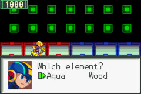
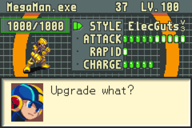
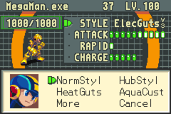

# Mega Man Battle Network 2 – Style Change QoL

Style Change in Mega Man Battle Network 2 (GBA) takes 280 battles, the element is random, and MegaMan can only hold two styles at a time. These patches change that.

| Pick the element | Battles left | Every style, paged |
|---|---|---|
|  |  |  |

- **Style Change every 100 battles** instead of 280. If your save is already past 100, the next battle triggers it.
- **Pick the element.** At a Style Change MegaMan asks which element you want. Only elements the new style type doesn't have yet are offered. The type is still decided by how you fight, as before. Hub Style is unchanged.
- **Keep every style.** No more overwriting: MegaMan keeps all 16 elemental styles plus Normal and Hub. The style switcher in the MegaMan screen shows them a page at a time (Normal and Hub first, then one page per type, "More" for the next). Once all four elements of a type are owned, Style Changes give the next type you fight like the most; once all 16 are owned, there are no more Style Changes.
- **Battles left.** A small number in the MegaMan screen's title bar (the "37" above) shows how many battles are left until the next Style Change. Nothing else is revealed: no style points, no hint of which style comes next. It appears once Style Changes are unlocked in the story and disappears when there is nothing left to earn.

## Download

**Easiest: the [web patcher](https://squivix.github.io/mmbn2-style-qol/).** Pick your ROM, tick the changes you want and set any battle count from 1 to 255 (presets 50 / 80 / 100 / 120 / 150 / 200). It runs entirely in your browser.

Or use the regular patch files: get **`bn2_styleqol_v1.0.zip`** from the [latest release](../../releases/latest), or grab single patches from [`patches/`](patches/).

| Patch | What it does |
|---|---|
| `bn2_styleqol_us` / `_eu` | all four changes (use this one) |
| `bn2_100battles_us` / `_eu` | Style Change every 100 battles |
| `bn2_pickelement_us` / `_eu` | pick the element |
| `bn2_keepstyles_us` / `_eu` | keep every style |
| `bn2_battlesleft_us` / `_eu` | battles left in the MegaMan screen |

`_us` is for the American ROM, `_eu` for the European one.

- **Everything:** apply `bn2_styleqol`, nothing else.
- **Only some changes:** use the `.ips` files of the ones you want. They can be applied on top of each other in any order. (`.bps` patches only go on a clean ROM, so with `.bps` you can pick just one.)

The changes work on their own and together. Without "pick the element", the element is random among the ones the type doesn't have yet. Without "100 battles", the battles-left count starts from 280. The patch files use 100 battles; for another count, use the web patcher.

## Required ROM

| Patch | ROM | Game code | CRC32 | SHA-1 |
|---|---|---|---|---|
| `_us` | Mega Man Battle Network 2 (USA) | AE2E, rev 0 | `6D961F82` | `601b5012f77001d2c5c11b31304afafc45a70d0b` |
| `_eu` | Mega Man Battle Network 2 (Europe) | AM2P, rev 0 | `66341F3B` | `13d8c1978cbcd9ca2a127168544fda176e0a4d6c` |

The Legacy Collection is not supported.

## How to patch

- **`.bps`** (refuses to patch the wrong ROM): [Rom Patcher JS](https://www.marcrobledo.com/RomPatcher.js/), Floating IPS (Flips), or load it directly in mGBA (File → Load patch).
- **`.ips`** (for stacking, Lunar IPS and older tools): does **not** check the ROM, so verify the CRC32 above. Applying a `_us` patch to the European ROM, or the other way round, will break the game.

Patch a copy of your ROM. Existing save files work.

## Known limitations

- With "keep every style", don't load a save holding more than three styles in the unpatched game: its style switcher crashes with that many.
- Style trading over link cable can offer only your first three styles (the trade screen has room for three).
- As in the original game, a Style Change gives you the style without equipping it, and the NaviChip limit (5, or 8 for Team and Hub Style) still applies when switching.

## Credits

- Save layout: vgperson's [MMBN Save Editor](https://github.com/vgperson/MMBNSaveEditor)
- Mechanics: The Rockman EXE Zone wiki
- Text: Prof. 9's [TextPet](https://github.com/Prof9/TextPet)
- Tools: armips (Kingcom), Floating IPS (Alcaro), mGBA (endrift), Ghidra

Mega Man Battle Network is © Capcom. This project distributes patches only, no game data.
